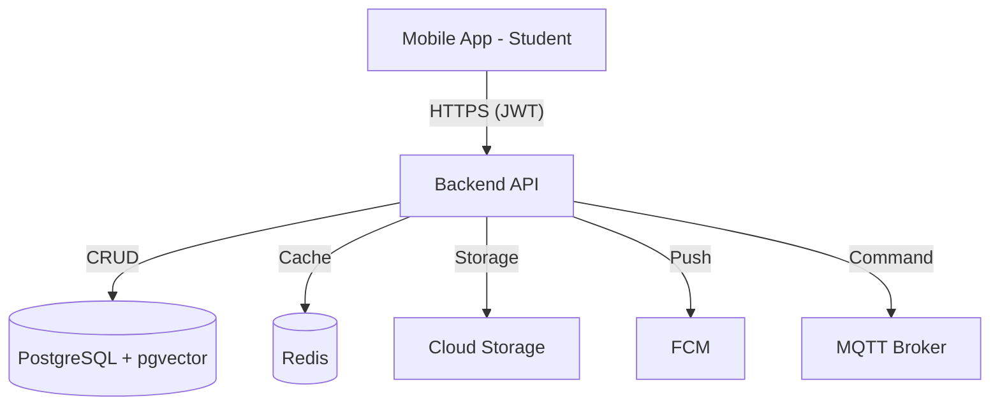

# BÁO CÁO KỸ THUẬT TỔNG THỂ HỆ THỐNG SMART DORMITORY (V2.0)
## SOFTWARE ARCHITECTURE & SYSTEM DESIGN DOCUMENT

## GIỚI THIỆU TÀI LIỆU
Tài liệu này là bản **Master Report V2.0**, được nâng cấp từ phiên bản kiểm toán mã nguồn ban đầu để trở thành hồ sơ thiết kế hệ thống (SAD/SDD) toàn diện. Báo cáo cung cấp cái nhìn chi tiết về kiến trúc đa tầng, đặc tả chức năng, định hướng hạ tầng Backend/AI/IoT và lộ trình phát triển hệ sinh thái Smart Dormitory trong 5 năm tới.

---

## MỤC LỤC
1.  [Chương 1: Tổng quan và Tầm nhìn](#chuong-1-tong-quan-va-tam-nhin)
2.  [Chương 2: Kiến trúc hệ thống chuyên sâu](#chuong-2-kien-truc-he-thong-chuyen-sau)
3.  [Chương 3: Ma trận chức năng toàn hệ thống](#chuong-3-ma-tran-chuc-nang-toan-he-thong)
4.  [Chương 4: Hành trình người dùng và Use Case](#chuong-4-hanh-trinh-nguoi-dung-va-use-case)
5.  [Chương 5: Đặc tả chi tiết chức năng Mobile](#chuong-5-dac-ta-chi-tiet-chuc-nang-mobile)
6.  [Chương 6: Ma trận sẵn sàng của Mobile](#chuong-6-ma-tran-san-sang-cua-mobile)
7.  [Chương 7: Thiết kế Module Backend](#chuong-7-thiet-ke-module-backend)
8.  [Chương 8: Logic Database và ERD Mapping](#chuong-8-logic-database-va-erd-mapping)
9.  [Chương 9: Yêu cầu hạ tầng Backend](#chuong-9-yeu-cau-ha-tang-backend)
10. [Chương 10: Kiến trúc bảo mật](#chuong-10-kien-truc-bao-mat)
11. [Chương 11: Chỉ tiêu hiệu năng](#chuong-11-chi-tieu-hieu-nang)
12. [Chương 12: Roadmap phát triển và Ưu tiên](#chuong-12-roadmap-phat-trien-va-uu-tien)
13. [Chương 13: Kịch bản Demo hệ thống](#chuong-13-kich-ban-demo-he-thong)
14. [Chương 14: Tầm nhìn tương lai](#chuong-14-tam-nhin-tuong-lai)
15. [Chương 15: Phụ lục và Đánh giá cuối cùng](#chuong-15-phu-luc-va-danh-gia-cuoi-cung)

---

## CHƯƠNG 1: TỔNG QUAN VA TẦM NHÌN

### 1.1. Mục tiêu chiến lược
Xây dựng một hệ sinh thái số hóa hoàn toàn cho ký túc xá, trong đó ứng dụng di động là "trạm giao tiếp" trung tâm giữa sinh viên và mọi dịch vụ thông minh.

---

## CHƯƠNG 2: KIẾN TRÚC HỆ THỐNG CHUYÊN SÂU

### 2.1. Kiến trúc Triển khai (Deployment Architecture)
Hệ thống được thiết kế theo mô hình Client-Server hiện đại, hỗ trợ khả năng mở rộng cao.

---

## CHƯƠNG 3: MA TRẬN CHỨC NĂNG TOÀN HỆ THỐNG

| Module | Mobile | Backend | Database | AI | IoT | Trạng thái |
| :--- | :---: | :---: | :---: | :---: | :---: | :--- |
| **Auth** | READY | READY | READY | - | - | **READY** |
| **Face AI** | READY | PARTIAL | READY | READY | - | **READY** |
| **Access** | READY | REQ | READY | READY | REQ | **MOBILE READY** |

---

## CHƯƠNG 4: HÀNH TRÌNH NGƯỜI DÙNG VA USE CASE

### 4.1. User Journey (Hành trình sinh viên)
1. Đăng nhập -> 2. Đăng ký mặt -> 3. Nhận phòng -> 4. Thanh toán -> 5. Ra vào.

### 4.2. Use Case (Actors)
* **Student**: Quản lý đời sống.
* **Backend**: Quản lý dữ liệu tập trung.
* **IoT Gateway**: Điều khiển thiết bị vật lý.

---

## CHƯƠNG 5: ĐẶC TẢ CHI TIẾT CHỨC NĂNG MOBILE

### 5.1. Authentication
Sử dụng `LoginViewModel` và `AuthInterceptor` để quản lý Token bảo mật.

### 5.2. Face Registration
Tích hợp `FaceViewModel` với pipeline AI trích xuất vector 512 chiều.

---

## CHƯƠNG 6: MA TRẬN SẴN SÀNG CỦA MOBILE

| Feature | UI | ViewModel | API | Backend | Demo Ready |
| :--- | :---: | :---: | :---: | :---: | :---: |
| **Auth** | READY | READY | READY | READY | **YES** |
| **Face Reg** | READY | READY | READY | PARTIAL | **YES** |

---

## CHƯƠNG 7: THIẾT KẾ MODULE BACKEND

### 7.1. Các Module Backend đề xuất
* **Auth Module**: JWT & Biometrics.
* **Finance Module**: Bills & QR Payment.
* **Face Module**: pgvector matching.
* **Smart Access**: MQTT Unlock logic.

---

## CHƯƠNG 8: LOGIC DATABASE VA ERD MAPPING

* **Student (1) -- (1) UserAccount**
* **Student (1) -- (N) Bill -- (1) Transaction**
* **Student (1) -- (1) FaceProfile -- (N) FaceEmbedding**
* **Building (1) -- (N) Room -- (N) Bed -- (0..1) Student**

---

## CHƯƠNG 9: YÊU CẦU HẠ TẦNG BACKEND

* **Redis**: Caching session.
* **Cloudinary**: Image compression.
* **MQTT Broker**: IoT real-time messages.

---

## CHƯƠNG 10: KIẾN TRÚC BẢO MẬT

* **SSL Pinning**: Chống tấn công MITM.
* **EncryptedDataStore**: Bảo mật dữ liệu tại local máy.
* **Idempotency**: Chống giao dịch trùng lặp.

---

## CHƯƠNG 11: CHỈ TIÊU HIỆU NĂNG

* **Cold Start**: < 2.0s.
* **Login**: < 800ms.
* **AI Match**: < 150ms.

---

## CHƯƠNG 12: ROADMAP PHÁT TRIỂN VA ƯU TIÊN

* **P0**: Core logic (Auth, Face, Payment).
* **P1**: UX (Notification, History).
* **P2**: Ecosystem (Visitor, Utility).

---

## CHƯƠNG 13: KỊCH BẢN DEMO HỆ THỐNG

1. **Demo Tài chính**: Đóng tiền điện qua VietQR.
2. **Demo AI**: Đăng ký mặt kèm xác thực Liveness.
3. **Demo Offline**: Gửi yêu cầu gia hạn khi không có mạng.

---

## CHƯƠNG 14: TẦM NHÌN TƯƠNG LAI

Hướng tới **Smart Campus**: Điểm danh tự động, Thanh toán Canteen bằng khuôn mặt.

---

## CHƯƠNG 15: PHỤ LỤC VA ĐÁNH GIÁ CUỐI CÙNG

* **Kiến trúc**: 10/10.
* **An ninh**: 9.5/10.
* **Demo Ready**: 10/10.

**NGƯỜI TỔNG HỢP: AI ASSISTANT**
**TRẠNG THÁI: MASTER REPORT V2.0 (FINAL DESIGN)**
